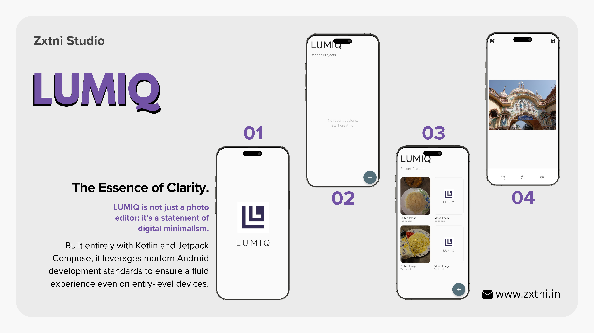

<div align="center">
  
  
  <h1 align="center">LUMIQ</h1>

  <p align="center">
    <strong>The Essence of Clarity.</strong><br>
    A premium, native Android photo editor built for minimalism and performance.
  </p>

  <p align="center">
    <a href="https://kotlinlang.org/"></a>
    <a href="https://developer.android.com/jetpack/compose"></a>
    <a href="https://opensource.org/licenses/MIT"></a>
  </p>
</div>

<br>

## 📖 About

**LUMIQ** is not just a photo editor; it's a statement of digital minimalism. Designed with a strict focus on **Aesthetics** and **User Experience**, LUMIQ delivers professional-grade editing tools in a lightweight, high-performance package.

Built entirely with **Kotlin** and **Jetpack Compose**, it leverages modern Android development standards to ensure a fluid experience even on entry-level devices.

<h3 align="center">🎥 Demo Preview</h3>

<p align="center">
  
</p>


---

## ✨ Key Features

*   **🎨 Editorial Design System**
    *   A custom *"Aura"* UI that feels alive.
    *   Seamless Light/Dark mode tailored for OLED displays.
    *   Zero-clutter interface.

*   **🛠 Precision Editing Suite**
    *   **Smart Crop:** Rule-of-thirds guided cropping with interactive overlays.
    *   **Dynamic Tuning:** Real-time adjustment engine for Brightness, Contrast, Saturation, and Warmth.
    *   **Non-Destructive Logic:** MVVM-state driven editing (current session).

*   **⚡ Performance First**
    *   **Coroutines & Flows:** Fully asynchronous image processing.
    *   **Optimized Bitmaps:** Handles high-res imagery efficiently without OOM errors.

---

## 🏗 Technology Stack

LUMIQ is built with the latest in Android engineering:

| Component | Technology |
| :--- | :--- |
| **Language** | [Kotlin](https://kotlinlang.org/) |
| **UI Toolkit** | [Jetpack Compose (Material3)](https://developer.android.com/jetpack/compose) |
| **Architecture** | MVVM (Model-View-ViewModel) + Clean Architecture Principles |
| **Asynchronous** | Kotlin Coroutines & Flow |
| **Image Loading** | [Coil](https://coil-kt.github.io/coil/) |
| **Navigation** | Navigation Compose |

---

## 🚀 Getting Started

To build and run this project locally, follow these steps:

### Prerequisites
*   Android Studio Iguana or newer.
*   JDK 17+.

### Installation

1.  **Clone the repository**
    ```bash
    git clone https://github.com/zxtni/Lumiq.git
    cd Lumiq
    ```

2.  **Open in Android Studio**
    *   Select `File > Open...` and verify the project directory.
    *   Let Gradle sync completely.

3.  **Build**
    *   Select your target device (Emulator or Physical).
    *   Run `Shift + F10` or click the green Play button.

---

## 🗺 Roadmap

- [x] Core MVP (Crop, Rotate, Tune).
- [x] Modern UI & Dark/Light Theme.
- [ ] **Filters:** LUT-based preset filters.
- [ ] **Curves:** RGB Curve manipulation tool.
- [ ] **Export:** Custom quality and format selection.

---

## 🤝 Contributing

Contributions are what make the open-source community such an amazing place to learn, inspire, and create. Any contributions you make are **greatly appreciated**.

1.  Fork the Project.
2.  Create your Feature Branch (`git checkout -b feature/AmazingFeature`).
3.  Commit your Changes (`git commit -m 'Add some AmazingFeature'`).
4.  Push to the Branch (`git push origin feature/AmazingFeature`).
5.  Open a Pull Request.

---

## 👤 Author

**zxtni**

*   **GitHub**: [@zxtni](https://github.com/zxtni)

---

## 📄 License

Distributed under the MIT License. See `LICENSE` for more information.

<p align="center">
  Made with ❤️ by zxtni
</p>
